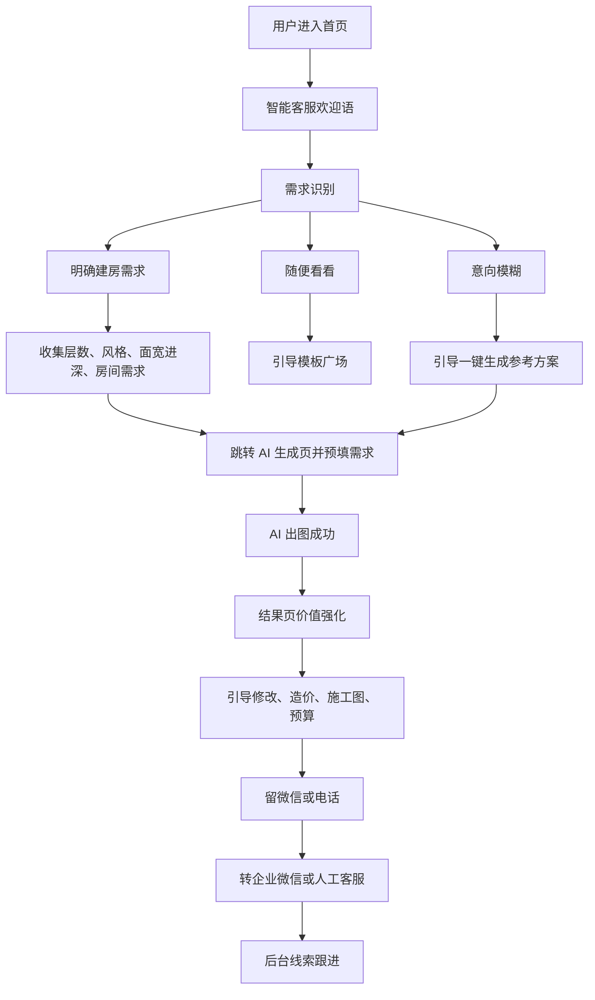

# 甲第灵光小程序智能客服落地设计方案

日期：2026-04-24

## 1. 方案定位

智能客服不是一个被动问答机器人，而是一个围绕“建房方案生成和线索转化”的流程型销售助手。

核心闭环：

```text
用户进线 -> 识别建房需求 -> 引导 AI 出图 -> 出图后强化价值 -> 留联系方式 -> 转接人工/企业微信 -> 后台跟进成交
```

推荐采用“本地智能客服 + 企业微信承接”的混合方案：

- 本地智能客服负责小程序内的需求识别、出图引导、留资触发、行为埋点和线索生成。
- 企业微信负责人工承接、私域跟进、持续沟通和成交转化。

这样既能保留小程序内完整的数据闭环，也能利用企业微信完成后续一对一跟进。

## 2. 当前项目基础

当前项目已经具备一部分可复用能力：

- 首页已有“联系服务商 / 智能客服”相关入口。
- 已有企业微信客服拉起和二维码兜底能力。
- 已有独立 `chat` 页面和后端 AI 流式聊天接口。
- 已有 AI 生成页 `/pages/aigenerate/aigenerate`。
- 已有生成详情页 `/pages/generatedetails/generatedetails`。
- 已有后台管理系统和工单、用户、企业微信绑定等基础能力。

当前缺口不是“有没有聊天能力”，而是缺少一套专门面向建房用户转化的流程、状态、埋点和线索管理。

## 3. 核心目标

第一期目标聚焦可验证的转化闭环：

1. 用户能从首页进入智能客服。
2. 智能客服能识别用户是否有自建房需求。
3. 用户能被引导到 AI 出图页完成首次方案生成。
4. 出图成功后能触发优化、造价、留资和转人工入口。
5. 后台能看到有效线索、来源、需求摘要和跟进状态。
6. 能统计出图成功率、有效留资率、人工转接率。

不建议第一期做复杂的全能 AI 客服、完整 CRM、企微消息深度同步或自动报价。

## 4. 用户分层

智能客服第一轮要完成用户分流。

| 用户类型 | 判断依据 | 处理策略 |
| --- | --- | --- |
| A. 明确建房用户 | 提到建房、宅基地、层数、造价、图纸、施工、外观、户型 | 追问关键参数，引导 AI 出图，并在高意向节点触发留资 |
| B. 浏览参考用户 | 表达“随便看看”“找案例”“看风格”“参考一下” | 引导模板广场、热门乡村别墅案例和一键生成体验 |
| C. 模糊潜在用户 | 暂未规划、不确定、想了解、还没想好 | 降低门槛，建议先生成一套参考方案 |

分流目标不是给用户贴标签，而是决定下一步动作：出图、看模板、培育或转人工。

## 5. 总体流程



## 6. 前端产品设计

### 6.1 首页入口

首页需要提供明确、强转化的智能客服入口。

建议入口：

- 浮动按钮：`AI建房顾问`
- 首页核心区按钮：`1分钟生成建房方案`
- 服务商区域按钮：`咨询建房方案`

入口点击后进入本地智能客服面板，不直接跳转企业微信。企业微信只在用户高意向或需要人工时触发。

### 6.2 智能客服页

建议新建独立页面：

```text
/pages/customerservice/customerservice
```

不建议直接复用现有 `chat` 页面。现有 `chat` 更偏通用 AI 聊天，智能客服需要流程状态、快捷按钮、留资卡片、出图引导和转人工规则。

页面结构：

- 顶部：客服身份和在线状态。
- 中部：对话消息流。
- 中部扩展：快捷选项卡片。
- 底部：输入框、发送按钮、常用行动按钮。
- 特定节点：显示 `一键生成`、`看模板广场`、`添加微信`、`电话咨询`、`转人工`。

### 6.3 AI 生成页联动

智能客服收集到基础需求后，跳转 AI 生成页并传入预填内容。

示例 prompt：

```text
新闽派，三层自建房，宅基地面宽12米，进深15米，需要4房2厅，外观大气，适合福建乡村居住。
```

跳转目标：

```text
/pages/aigenerate/aigenerate?source=customer_service&showSceneTabs=1&tab=exterior
```

需要通过 query 或 eventChannel 把需求摘要传给生成页，减少用户重复输入。

### 6.4 生成详情页转化

出图成功后，生成详情页是黄金转化节点。

建议新增转化区：

- `调整户型布局`
- `优化建筑外观`
- `精准测算造价`
- `对接设计老师`
- `添加微信获取完整方案`

点击这些按钮时，需要记录事件并创建或更新线索。

### 6.5 沉默提醒

智能客服页需要本地计时器。

触发规则：

- 5-10 秒无操作：提示“可以直接留言：新闽派、三层、12米面宽，一键出方案。”
- 30 秒无回复：提示“需要我帮你调整优化，出一版更贴合需求的方案吗？”
- 60 秒无互动：提示“我可以为你对接专业设计老师，一对一看方案和预算。”

沉默提醒要有频控，避免连续打扰。

## 7. 话术状态机

智能客服应采用“规则状态机 + AI润色”的模式。

核心状态：

| 状态 | 说明 | 下一步 |
| --- | --- | --- |
| `welcome` | 欢迎语和价值说明 | 进入需求识别 |
| `classify_intent` | 判断用户是明确建房、浏览参考还是意向模糊 | 进入不同分支 |
| `collect_requirement` | 收集层数、风格、面宽进深、房间功能 | 生成 prompt |
| `guide_template` | 引导看模板广场 | 继续培育或返回出图 |
| `guide_generate` | 引导 AI 出图 | 跳转生成页 |
| `post_generate` | 出图后价值强化 | 引导修改、造价、留资 |
| `lead_capture` | 收集微信或电话 | 创建线索 |
| `handoff_human` | 转接人工或企业微信 | 推送摘要 |
| `silent_recovery` | 沉默用户召回 | 回到出图、留资或收尾 |

关键原则：

- AI 负责自然语言表达。
- 规则负责状态、按钮、转人工和留资触发。
- 涉及造价、施工可行性、图纸深化和报价时，必须转人工。

## 8. 标准话术

### 8.1 欢迎语

```text
你好，我是甲第灵光 AI 建房顾问。
我可以用 1 分钟帮你生成户型参考、外观效果图和初步造价思路。
请问你近期有自建房或翻建房屋的计划吗？
```

### 8.2 明确建房用户

```text
太好了，我可以先帮你整理一版专属建房方案。
请问计划建几层？宅基地大概面宽和进深是多少？喜欢新闽派、新中式还是现代风格？
```

### 8.3 浏览参考用户

```text
没关系，可以先参考本地热门乡村别墅设计。
你可以先看模板广场，也可以直接生成一套参考方案，后面再慢慢调整。
```

### 8.4 意向模糊用户

```text
很多业主一开始也不确定怎么建。
可以先生成一套参考方案，看完布局、外观和预算方向后，再决定是否深入设计。
```

### 8.5 出图引导

```text
你现在只需要补充 3 类信息，我就能帮你生成第一版方案：
1. 建筑层数和喜欢的风格
2. 房间功能数量
3. 宅基地面宽和进深
```

### 8.6 出图完成

```text
你的专属建房方案已经生成。
当前是基础定制方案，后续可以继续优化户型布局、调整建筑外观，并进一步测算造价。
```

### 8.7 留资引导

```text
如果想让方案更贴合你家宅基地尺寸、居住习惯和预算，我可以为你对接专业设计老师一对一优化。
方便预留微信或电话吗？
```

### 8.8 转人工

```text
这个问题涉及造价、施工落地或方案深化，我建议直接对接专业设计老师。
我先把你的需求和已生成方案整理好，方便老师继续跟进。
```

## 9. 高意向触发规则

出现以下关键词或行为时，应触发高意向逻辑：

- 造价、报价、多少钱、预算、材料清单
- 施工、能不能建、审批、落地、结构
- 修改、优化、深化、施工图、平面图、户型调整
- 添加微信、电话、联系设计师
- 出图成功后点击优化类按钮
- 结果页停留超过 1 分钟且无下一步动作

触发后动作：

1. 创建或更新线索。
2. 生成需求摘要。
3. 展示留资卡片。
4. 引导企业微信或电话咨询。

## 10. 后端设计

### 10.1 会话表

建议新增 `customer_service_sessions`。

核心字段：

| 字段 | 说明 |
| --- | --- |
| `id` | 会话 ID |
| `user_id` | 用户 ID |
| `session_no` | 会话编号 |
| `source` | 来源：首页、模板广场、结果页等 |
| `current_stage` | 当前状态机阶段 |
| `intent_type` | 明确建房、浏览参考、意向模糊 |
| `intent_level` | low、medium、high |
| `demand_summary` | 需求摘要 |
| `source_task_no` | 关联 AI 出图任务 |
| `lead_id` | 关联线索 |
| `handoff_status` | 未转接、已建议、已转接 |
| `created_at` | 创建时间 |
| `updated_at` | 更新时间 |

### 10.2 事件表

建议新增 `customer_service_events`。

用于记录漏斗行为。

核心事件：

- `service_entry_click`
- `welcome_shown`
- `intent_classified`
- `requirement_collected`
- `generate_click`
- `generate_success`
- `post_generate_cta_click`
- `lead_submit`
- `wechat_open_click`
- `phone_call_click`
- `human_handoff_triggered`

### 10.3 线索表

建议新增 `customer_leads`。

核心字段：

| 字段 | 说明 |
| --- | --- |
| `id` | 线索 ID |
| `user_id` | 用户 ID |
| `name` | 用户姓名，可选 |
| `phone` | 电话 |
| `wechat` | 微信 |
| `enterprise_wechat_contact` | 企业微信联系人信息 |
| `demand_summary` | 需求摘要 |
| `house_floors` | 层数 |
| `house_style` | 风格 |
| `land_width` | 面宽 |
| `land_depth` | 进深 |
| `room_requirement` | 房间功能 |
| `source` | 来源 |
| `source_task_no` | 关联出图任务 |
| `intent_level` | 意向等级 |
| `status` | new、contacted、converted、invalid |
| `assigned_to` | 跟进人 |
| `remark` | 备注 |
| `created_at` | 创建时间 |
| `updated_at` | 更新时间 |

后台运营主要看线索表，不需要在第一期查看所有对话流水。

## 11. 后台管理设计

后台新增“客服线索”模块。

列表筛选：

- 今日新增
- 已出图未留资
- 已留资未联系
- 高意向待跟进
- 已转企业微信
- 已成交
- 无效线索

列表字段：

- 用户昵称
- 手机号或微信
- 企业微信状态
- 意向等级
- 需求摘要
- 来源页面
- 关联任务号
- 最近行为
- 跟进状态
- 创建时间

详情页展示：

- 用户基础信息
- 建房需求结构化字段
- AI 生成图预览
- 行为轨迹
- 转人工原因
- 跟进备注
- 状态流转记录

## 12. 企业微信承接

企业微信只负责人工承接和私域跟进，不承担完整前置转化流程。

转企微前，本地系统应生成摘要：

```text
用户需求：福建自建房，三层，新闽派，面宽12米，进深15米，关注造价和外观优化。
已完成动作：已生成 AI 方案，点击过精准测算造价。
建议跟进：先发送完整方案图，再沟通预算区间和施工图深化。
```

承接方式：

- 优先调用企业微信客服。
- 调用失败时展示二维码。
- 同时保留电话咨询入口。
- 线索状态记录为 `handoff_suggested` 或 `handoff_opened`。

## 13. AI 能力边界

AI 可以做：

- 识别用户意图。
- 提炼建房需求。
- 生成出图 prompt。
- 推荐下一步动作。
- 解释基础方案价值。
- 判断是否需要转人工。

AI 不应该做：

- 给出精确报价。
- 承诺施工可行性。
- 代替设计师给最终图纸结论。
- 虚构本地政策、材料价格或施工标准。
- 绕过留资和人工承接流程。

系统提示词方向：

```text
你是甲第灵光 AI 建房顾问。你的目标不是闲聊，而是引导用户完成建房方案生成、需求整理、留资和人工对接。
涉及造价、施工可行性、结构安全、施工图深化、合同报价时，必须建议转接专业设计老师。
回答要简短、主动、可执行，优先推动用户完成下一步动作。
```

## 14. 数据指标

第一期必须埋点的核心指标：

| 指标 | 含义 |
| --- | --- |
| 首页客服入口点击率 | 首页流量中有多少进入客服 |
| 欢迎语后回复率 | 用户是否愿意开始互动 |
| 需求识别完成率 | 是否完成基本分流 |
| AI 生成页跳转率 | 客服是否成功推动出图 |
| 出图成功率 | 用户是否完成 AI 方案生成 |
| 结果页 CTA 点击率 | 出图后是否继续互动 |
| 有效留资率 | 是否留下微信或电话 |
| 人工转接率 | 是否进入人工承接 |

最重要的三个经营指标：

```text
出图成功率
有效留资率
人工转接率
```

## 15. 分期计划

### 第一期：MVP 闭环

目标：跑通首页到出图、留资、转人工的最小闭环。

范围：

- 首页智能客服入口。
- 独立智能客服页。
- 固定流程话术。
- 三类用户分流。
- 需求收集和生成页预填。
- 出图后转化卡片。
- 留资和企业微信承接。
- 基础埋点。
- 后台线索列表。

不做：

- 完整 CRM。
- 复杂 AI 自动销售。
- 精确报价。
- 深度企微消息同步。

### 第二期：智能化增强

目标：提升转化效率和运营判断能力。

范围：

- AI 自动总结需求。
- 意向评分。
- 高意向自动创建线索。
- 个性化结果页话术。
- 后台线索跟进状态流转。
- 常见问题知识库。

### 第三期：成交系统

目标：把线索跟进变成完整成交管理。

范围：

- 设计师分配。
- 跟进记录。
- 报价或预算单。
- 方案修改工单。
- 企业微信回调绑定。
- 成交转化统计。

## 16. 验收标准

第一期验收标准：

- 首页能进入智能客服。
- 智能客服能完成欢迎、分流和需求收集。
- 用户能从客服页跳转到 AI 生成页。
- 生成页能接收客服预填需求。
- 出图成功后出现优化、造价、留资和人工入口。
- 后台能看到客服线索。
- 后台能看到线索来源、需求摘要、关联任务号和跟进状态。
- 高意向关键词能触发转人工话术。
- 能统计出图成功率、有效留资率、人工转接率。

## 17. 风险与规避

| 风险 | 规避策略 |
| --- | --- |
| AI 聊天跑偏 | 使用规则状态机控制流程，AI 只做润色和摘要 |
| 用户被过早索要联系方式 | 留资放在出图成功或高意向节点后 |
| 企业微信链路无法拉起 | 保留二维码和电话兜底 |
| 后台线索太杂 | 只把有效行为沉淀为线索，普通聊天只记录事件 |
| 造价承诺风险 | AI 不直接报价，造价问题强制转人工 |
| 体验打扰过强 | 沉默提醒加频控，允许用户关闭 |

## 18. 最终结论

智能客服的核心不是回答问题，而是推动用户完成“看见方案”的关键动作。

本项目最稳的落地方式是：

```text
本地智能客服控制转化流程，企业微信承接人工和私域跟进。
```

第一期只需要把“首页进线、AI 出图、出图后留资、人工承接、后台线索”跑通。等数据证明有效后，再逐步升级意向评分、知识库、企微回调和成交管理。
